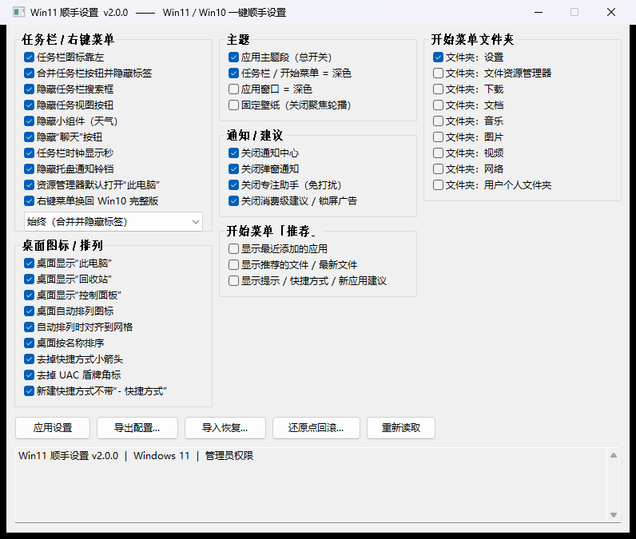

# Win11 顺手设置

把 Win11 那些「装完机必改」的开关一次性设好。原生 C 单文件，**一个 exe，零依赖，232 KB**。

> 从原本的 PowerShell 脚本方案重写而来。等效工作量 **299.5 ms → 16.8 ms**，快约 18 倍。


-A8B9CC)




---

## 特性

- **双形态单 exe** —— 双击进图形界面，带参数走命令行，同一个文件
- **39 个开关 → 51 个注册表值** —— 涵盖任务栏、桌面、主题、通知、开始菜单
- **配置导出 / 导入恢复** —— 读当前系统真实状态导出 JSON，换新电脑导入即还原（本次新增）
- **差异预览 + 自动备份 + 还原点回滚** —— 导入前先给你看改什么，改前自动存档，改坏了能精确回滚
- **零运行时依赖** —— 静态链接 CRT，只依赖 6 个系统 DLL，不装 .NET、不装 PowerShell 模块
- **显示系统真实状态** —— 界面读的是注册表实际值，不是配置文件里的期望值

## 快速开始

1. 从 [`win11tweaks/dist/Win11Tweaks.exe`](win11tweaks/dist/Win11Tweaks.exe) 下载 exe
2. 把它和 [`settings.ini`](win11tweaks/dist/settings.ini) 放在同一个目录
3. **双击运行** → 图形界面，勾选你想要的，点「应用设置」
4. 部分项（去箭头、去 UAC 盾牌）需要管理员权限，程序会按需自动提权

改完任务栏 / 桌面图标后，通常需要**重启资源管理器或注销**才能看到效果——这是 Windows 的限制。

## 命令行用法

不带任何参数时打开图形界面。

| 命令 | 简写 | 说明 |
|---|---|---|
| `--apply` | `-a` | 按 `settings.ini` 应用设置（**默认行为**） |
| `--export [文件]` | `-e` | 读取当前系统状态，导出为配置文件 |
| `--import <文件>` | `-i` | 导入配置并恢复：先出差异 → 再备份 → 最后写入 |
| `--diff <文件>` | `-d` | 只显示「当前系统 vs 配置文件」的差异，不写任何东西 |
| `--status` | `-s` | 列出全部 51 个受管注册表值的当前状态 |
| `--backup` | | 只把当前状态备份成还原点 |
| `--restore <文件>` | `-r` | 从某个还原点文件恢复 |
| `--gui` | `-g` | 强制打开图形界面 |
| `--help` | `-h` | 显示帮助 |
| `--version` | | 显示版本号 |

通用选项：`-y / --yes`（不再询问）、`-n / --dry-run`（预演不写入）、`--no-backup`、`--no-elevate`、`--ini <文件>`

退出码：`0` 成功 · `1` 运行时失败 · `2` 参数错误 · `4` 请求转图形界面

## 换新电脑：三步还原

```bat
:: ① 旧电脑：导出当前真实设置
Win11Tweaks.exe --export

:: ② 把生成的 profile_*.json 拷到新电脑

:: ③ 新电脑：先看差异，再导入
Win11Tweaks.exe --diff   "D:\profile_20261006_165529.json"
Win11Tweaks.exe --import "D:\profile_20261006_165529.json"
```

导入只写**有差异**的项，且执行前会自动把当前状态存成还原点。改坏了用 `--restore` 精确回滚。

> 配置文件记录的是「注册表值」粒度，`"exists": false` 表示该值当前不存在（导入时会精确删除）——
> 这是「删除 → 恢复」能完全还原的关键。

## 性能

每项实测 20 次：

| 项目 | 平均 | 最慢 | 慢于 200 ms |
|---|---|---|---|
| `--status`（读 51 个值 + 输出） | 16.8 ms | 17.7 ms | 0 |
| `--apply --dry-run` | 17.4 ms | 18.2 ms | 0 |
| `--export` / `--diff` | 16.6 ms | 17.5 ms | 0 |
| `--import`（同源配置） | 16.7 ms | 19.0 ms | 0 |
| *旧方案*：PowerShell 5.1 冷启动 | 134.5 ms | 137.7 ms | 0 / 5 |
| *旧方案*：读 51 次注册表（等效工作量） | **299.5 ms** | 303.5 ms | **5 / 5** |

体积 232 KB · 内存（GUI）私有 3.2 MB / 工作集 20.2 MB · 依赖 6 个系统 DLL

## 构建

需要 MSVC BuildTools 2022 + Windows SDK 10：

```powershell
cd win11tweaks
.\build.ps1          # 增量构建 -> dist\Win11Tweaks.exe
.\build.ps1 -Clean   # 全量重建
.\build.ps1 -Trace   # 带埋点构建（用于性能分析）
```

## 目录结构

```
win11tweaks/
├─ src/             C 源码（wt.h / main.c / util.c / reg.c / tweaks.c / profile.c / cli.c / gui.c）
├─ dist/            发布目录（exe + settings.ini + backups/）
├─ docs/            文档用图
├─ build.ps1        构建脚本
├─ bench.ps1        性能基准脚本
└─ 说明.md          完整说明书
```

**完整文档（39 个开关速查表、GUI 说明、缺陷复盘、验证矩阵）见 [`win11tweaks/说明.md`](win11tweaks/说明.md)。**

---

## 说明

- 本工具**只动自己管辖的那 51 个注册表值**，不碰系统其它配置
- 受 UCPD 驱动保护的值（如 `TaskbarDa`）也能写——自有进程名不在驱动的拦截名单内，无需任何 hack
- 目前**未附加开源许可证**（默认保留所有权利）。如需指定，请告知希望采用哪种

## 致谢

开关清单整理自社区流传的 Win11 设置脚本，本项目为完全重写实现。
